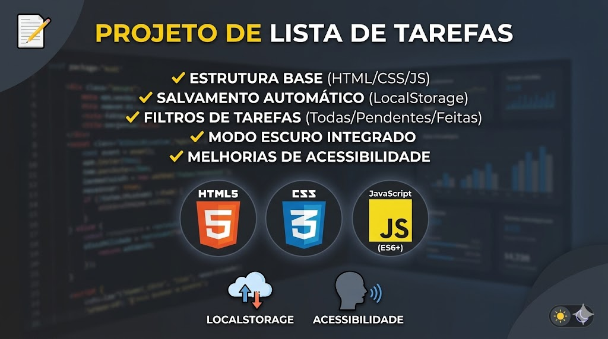

# 📝 Todo-List Project

Projeto de gerenciamento de tarefas desenvolvido para praticar manipulação de DOM, estilização CSS e deploy automatizado.

---

## 🚀 O que já foi feito (Checklist)

- [x] Estrutura base do projeto (HTML/CSS/JS)
- [x] Refatoração da função `addTask` para melhor performance
- [x] Estilização de itens concluídos
- [x] Deploy ativo via GitHub Pages
- [x] Implementar salvamento automático (LocalStorage)
- [x] Criar botão para excluir todas as tarefas de uma vez
- [x] Adicionar filtro de tarefas (Concluídas / Pendentes)
- [x] adicionar modo escuro (Dark Mode)

## 🛠️ Próximos Passos
- [ ] Melhorar a acessibilidade do formulário
- [ ] Adicionar animações ao excluir tarefas
---

## 💻 Tecnologias
* HTML5 / CSS3
* JavaScript (ES6+)
* GitHub Pages
